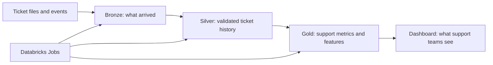

# Guided Databricks demo

This walkthrough is for someone learning Databricks by showing the support-operations project.
The current pipeline has Bronze ingestion, Silver validation and ticket state, event streaming,
and four Gold products. Risk scoring and AI investigation briefs are planned later. A native
Databricks dashboard is now an explicit Phase 8 deliverable; until then, use the workspace pages
and queries below to follow the data path.
The [performance experiment](../validation/performance-results.md) is also complete.
The historical feature backfill supports nonempty chronological training, validation, and test
cohorts. Both candidates are visible in MLflow, but the current synthetic labels do not yield an
acceptable risk model; see the [model evaluation](../validation/model-training.md).



## The story to tell

1. **Raw evidence enters Bronze.** In Catalog Explorer, open `support_dev.bronze.tickets` and
   `support_dev.bronze.ticket_events`. Bronze keeps source values and ingestion metadata so you
   can inspect what arrived.
2. **Silver turns it into trustworthy state.** Open `support_dev.silver.tickets`,
   `support_dev.silver.ticket_events`, and `support_dev.silver.ticket_state`. Compare them with
   `support_dev.ops.invalid_records` and `support_dev.ops.quality_metrics` to show how bad rows
   are retained and counted.
3. **Gold answers support questions.** Open `support_dev.gold.support_operations` for hourly
   backlog and SLA metrics, `customer_support_health` for customer context,
   `incident_signals` for unusual product volume, and `ticket_features` for active-ticket
   scoring inputs.
4. **Jobs make the flow repeatable.** In Workflows → Jobs, inspect the latest runs of
   `support-ops-silver-transformations` and the Gold jobs. The feature job has a
   [verified run](https://dbc-aa6ccf23-381b.cloud.databricks.com/jobs/818023496355765/runs/193671244255956?o=7474645852800686)
   for `2026-01-01 05:00 UTC`. Each Gold row includes `_pipeline_run_id`, tying it to a run.
5. **Spark chooses a plan.** Open the
   [performance job](https://dbc-aa6ccf23-381b.cloud.databricks.com/jobs/10111217004781/runs/1054269642150760?o=7474645852800686)
   and compare its four rows in `support_dev.ops.spark_performance_runs`. The default plan
   broadcast the small account table and was about twice as fast as forcing a sort-merge join.

## A ten-minute live walkthrough

Open the SQL editor in the dev workspace and run these read-only queries. The fixed historical
hour is deliberate: it uses data already validated in the dev workspace and is repeatable.

**1. Show the operational picture.**

```sql
SELECT product_id, support_tier, customer_segment,
       tickets_created, open_backlog, sla_breach_rate
FROM support_dev.gold.support_operations
WHERE hour = TIMESTAMP '2026-01-01 04:00:00'
ORDER BY tickets_created DESC
LIMIT 10;
```

**2. Show why incident signals appeared.**

```sql
SELECT product_id, ticket_count, unique_customers,
       ticket_volume_baseline, incident_signal
FROM support_dev.gold.incident_signals
WHERE time_window = TIMESTAMP '2026-01-01 04:00:00'
ORDER BY ticket_count DESC;
```

**3. Show the scoring inputs for active tickets.**

```sql
SELECT ticket_id, priority, support_tier, ticket_age_minutes,
       minutes_to_sla, customer_ticket_count_30d,
       product_ticket_count_24h, customer_breach_rate_90d
FROM support_dev.gold.ticket_features
WHERE as_of = TIMESTAMP '2026-01-01 05:00:00'
ORDER BY minutes_to_sla ASC
LIMIT 10;
```

The feature table has 1,634 distinct active tickets at that scoring point. `sla_breached` is
intentionally null: a future outcome cannot be known when the ticket is scored. The later ML
phase will turn these inputs into risk scores. Historical training rows already attach later
observed outcomes without exposing them as scoring inputs.

**4. See how the model will learn from earlier tickets.**

```sql
SELECT split, COUNT(*) AS tickets, SUM(label) AS SLA_breaches
FROM support_dev.ml.training_dataset
WHERE label_as_of = TIMESTAMP '2026-09-30 00:00:00'
GROUP BY split
ORDER BY split;
```

This returns 6,293 training, 735 validation, and 1,405 test tickets. `label=1` means the
ticket ultimately breached its resolution SLA. Open `support_dev.gold.ticket_features` beside
this table to see that the features were recorded earlier, before the outcome was known.

**5. Trace one ticket backward.** Copy a `ticket_id` from query 3 and search for it in
`support_dev.silver.ticket_state`, `support_dev.silver.ticket_events`, and
`support_dev.bronze.ticket_events` in Catalog Explorer. Silver is validated, ordered state;
Bronze is the retained raw input. For historical scoring points, the feature job reconstructs
state from Silver history rather than reading today's `silver.ticket_state` directly.

**6. Inspect the ML experiment.** In AI/ML → Experiments, open
`/Users/varshitaravi@yahoo.com/support-ops-support_dev-sla-risk`. Compare validation and test
PR-AUC for the logistic baseline and gradient-boosted tree. The tree's latest run is tagged
`deployment_decision=rejected`: it looked better on validation but fell below the test-period
breach prevalence. Open its `training_manifest.json` to see the exact feature list, time ranges,
and dataset version. This is why the project does not yet display live ticket risk scores.

## What the final demo will add

As the project reaches Phases 6–8, extend the walkthrough from the active-ticket features to
model predictions, then to the grounded investigation brief. The dashboard should let a viewer
start with a support signal, open the relevant ticket or customer context, and follow links to
the source tables and job runs. Keep the dashboard definition in version control so the demo can
be recreated in a clean Databricks workspace.
